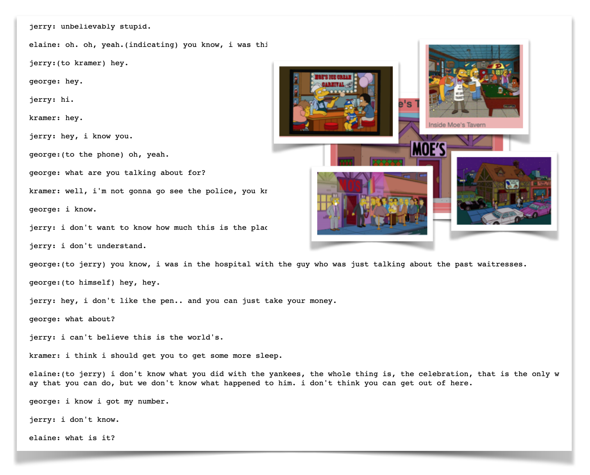

# Deeplearning-TV-Script-Generation

The project is RRN for Udacity deeplearning nd .The Neural Network generate Seinfeld TV scripts using RNNs, based on patterns it recognizes in the training data.

## Prerequisites

* conda    4.7.12
* pytorch  1.3.0                
* python   3.7.5

## Versioning

We use [SemVer](http://semver.org/) for versioning. For the versions available, see the [tags on this repository](https://github.com/your/project/tags).

## Built With

* [Pytorch](https://pytorch.org/) - An open source machine learning framework that accelerates the path from research prototyping to production deployment.

## Authors

* **Tom Ge** - *Fullstack egineer* - [github profile](https://github.com/tomgtqq)

## License

This project is licensed under the MIT License
